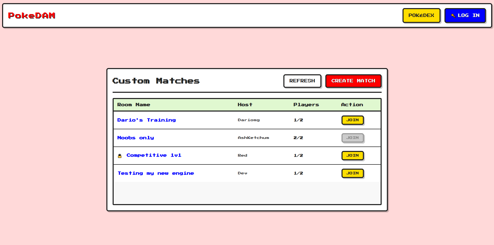
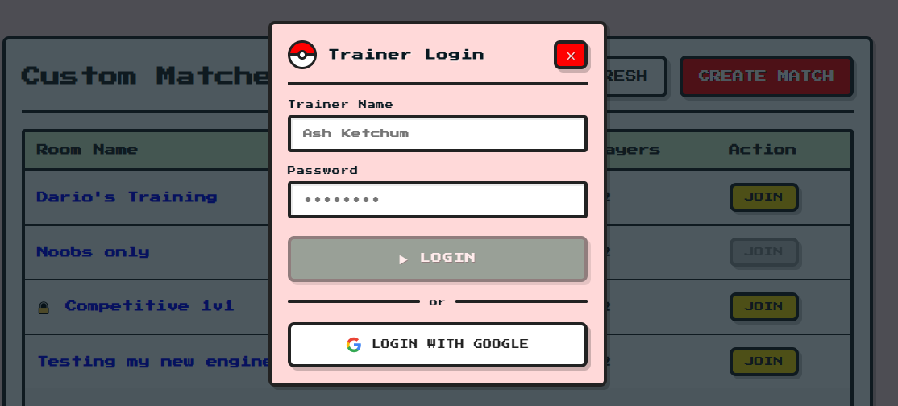
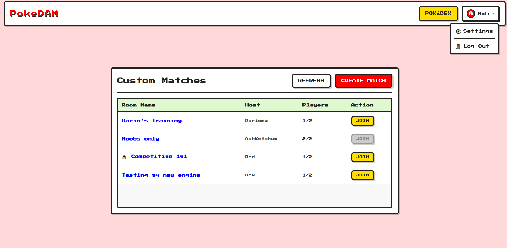
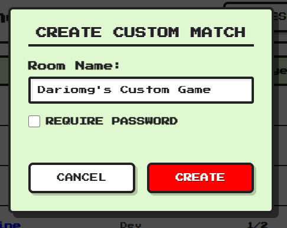
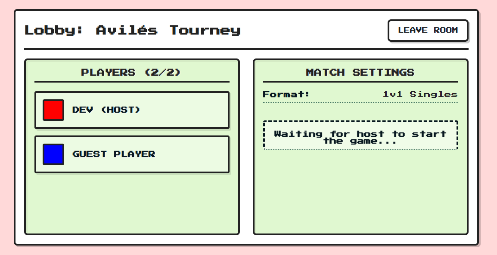
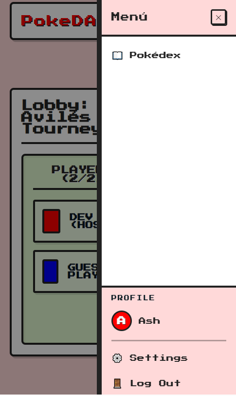

# Changelog

## Desarrollo Inicial del Cliente

### Core
- Implementación del concepto de cliente utilizando **Angular**.

  
*Vista previa de la interfaz principal del cliente Angular.*

### Sistema de Usuarios y Autenticación
- **Acceso Flexible**: El proceso de login es opcional. Se permite el acceso al gestor de salas y búsqueda de partidas directamente como **invitado**.
- **Propósito del Login**: El inicio de sesión se reserva para la persistencia de progreso entre dispositivos, evitando ser un paso intrusivo para el usuario casual.

  
*Interfaz del popup de inicio de sesión opcional.*

  
*Estado de la aplicación con la sesión iniciada y menú de perfil activo.*

### Gestión de Partidas (Matchmaking)
La interfaz de búsqueda de partidas se estructura en tres bloques principales:

#### 1. Buscador de Partidas
- Visualización de la lista de partidas disponibles y su estado actual.
- **Futuro**: Se prevé la implementación de un filtro de búsqueda por nombre en la parte superior.
- Botón de acceso rápido para la creación de nuevas salas.

#### 2. Creador de Partidas
- Formulario para asignar nombre a la sala.
- Soporte para **partidas privadas** mediante contraseña opcional (activable vía checkbox).
- **Experiencia de Usuario (UX)**: 
    - Se guardan el nombre de la partida y el estado de privacidad al cancelar, facilitando una re-creación rápida.
    - La contraseña **no se guarda** tras cancelar para reforzar la confianza del usuario y garantizar la seguridad de sus datos.

  
*Formulario retro para la creación de nuevas salas de batalla.*

#### 3. Sala de Espera (Lobby)
- Muestra la lista de jugadores presentes y las características de la partida.
- Funcionalidad para abandonar la sala y regresar al buscador.
- Botón de inicio de partida exclusivo para el **Host** (Anfitrión).

  
*Interfaz de la sala de espera antes de iniciar el combate.*

### Diseño Responsivo
Se ha implementado una base sólida para la adaptabilidad en dispositivos móviles:

- **Header y Navegación**: El encabezado se adapta dinámicamente, comprimiendo el menú en un botón tipo hamburguesa que despliega un **Drawer** lateral.

  
*Adaptación del encabezado para pantallas estrechas.*

  
*Menú lateral desplegable para navegación en dispositivos móviles.*

> [!NOTE]
> El diseño responsivo para el componente de **búsqueda de partidas** (Matchmaking) está planificado y será agregado en una actualización posterior.